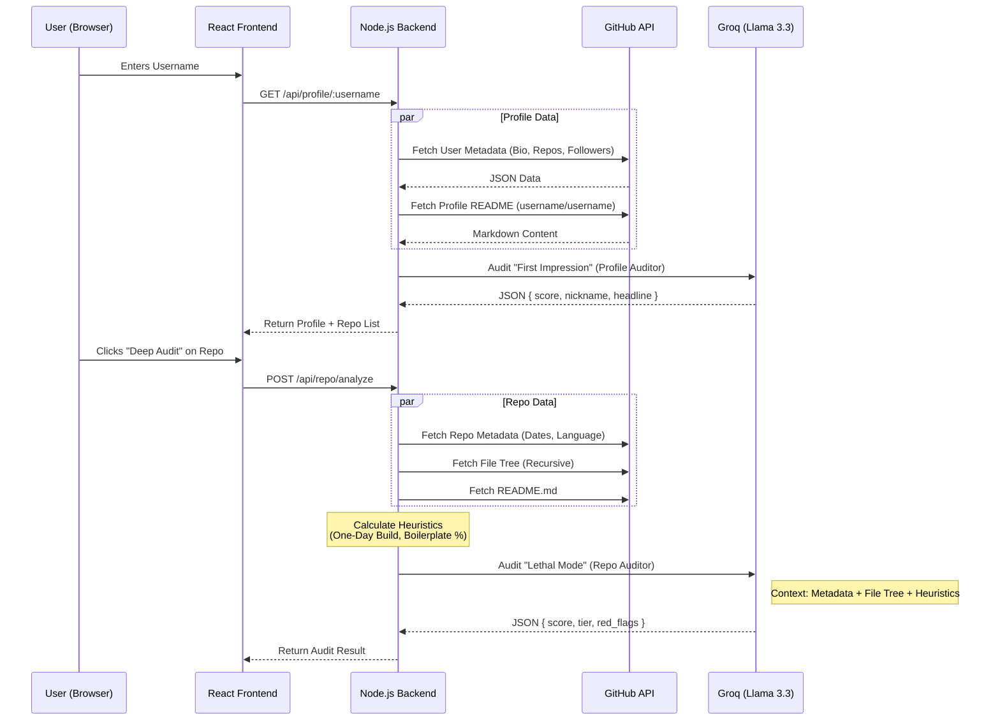

# Architecture & Design

This document outlines the internal architecture of the **AI GitHub Auditor**. The system is designed to be a high-performance, opinionated auditing tool that combines deterministic heuristics with Large Language Model (LLM) analysis.

## System Overview

The application follows a standard Client-Server architecture:
*   **Frontend:** React + Vite + Tailwind CSS (Single Page Application).
*   **Backend:** Node.js + Express (REST API).
*   **AI Provider:** Groq (running Llama 3.3 70B).
*   **Data Source:** GitHub REST API.

## Data Flow Diagram

## Core Components

### 1. Profile Auditor (`backend/src/ai/profileAuditor.ts`)
*   **Role:** Simulates a recruiter's 5-second scan.
*   **Input:** User Bio, Company, Blog, Follower count, and the special "Profile README".
*   **Output:** A "First Impression" score, an RPG-style nickname, and a summary of missing professional elements (e.g., missing LinkedIn, empty bio).

### 2. Repo Auditor (`backend/src/ai/repoAuditor.ts`)
*   **Role:** Simulates a cynical engineering manager.
*   **Logic:**
    1.  **Heuristics:** Calculates "Dev Duration" (Last Push - Created At). If < 24 hours, it flags a "One-Day Build".
    2.  **Context Assembly:** Combines the file tree structure, README content, and heuristic flags into a strict prompt.
    3.  **AI Analysis:** Sends this context to Llama 3.3 via Groq to classify the repo into strict tiers (FLAGSHIP, SOLID, NEUTRAL, NOISE).

## Design Decisions

### Why Groq?
We chose **Groq** running **Llama 3.3 70B** for two reasons:
1.  **Speed:** Groq's LPU (Language Processing Unit) architecture delivers tokens at near-instant speeds, essential for a real-time auditing tool.
2.  **Reasoning Capability:** Llama 3.3 70B offers "GPT-4 class" reasoning, which is required to follow our complex, multi-step "Cynical Manager" instructions without hallucinating high scores.

### Why Separate Profile vs. Repo Audits?
*   **Rate Limits:** Auditing every repository immediately would hit GitHub API rate limits and AI token limits instantly.
*   **User Experience:** Users often only care about specific "Flagship" projects. We load the profile fast, then let the user choose which repos to "Deep Dive" into.

### Why Mix Deterministic Penalties with AI?
Pure AI can be charmed. A well-written README might convince an LLM that a "Hello World" app is a complex distributed system.
*   **The Fix:** We calculate hard metrics (File Count, Dev Duration, Language Distribution) *before* calling the AI.
*   **The Result:** If the code shows >50% boilerplate or <24h development time, the AI is instructed (via System Prompt) to cap the score, regardless of how persuasive the README is.
